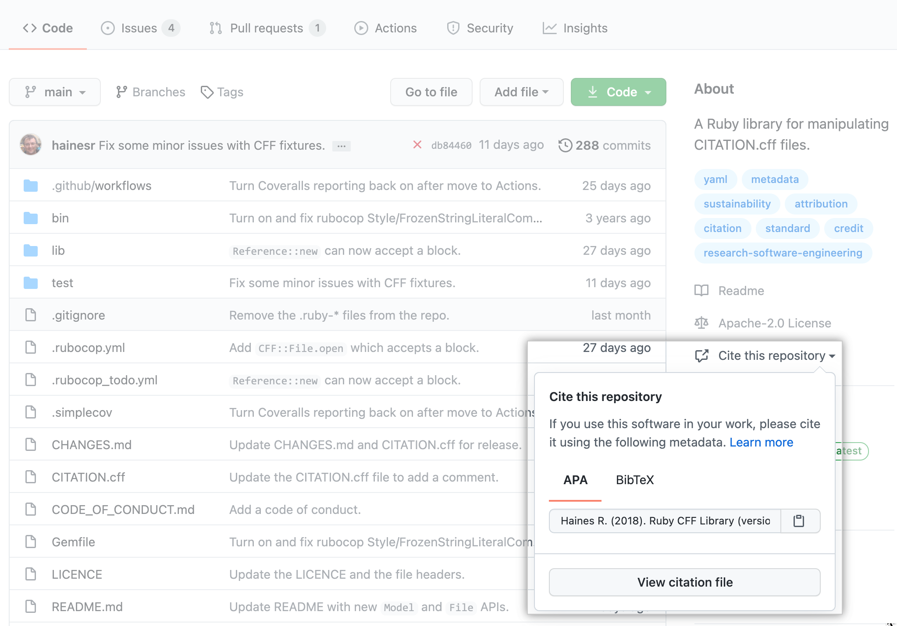
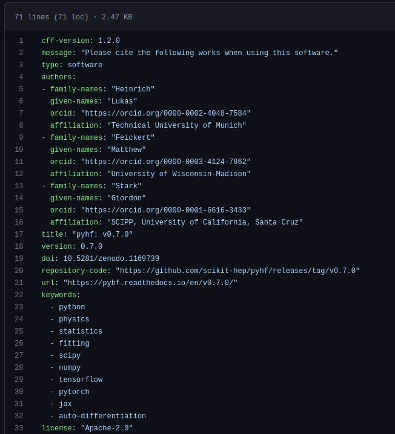

class: middle, center, title-slide
count: false

# Software Citation Tools, Technologies,<br> and Best Practices

.huge.blue[Matthew Feickert]<br>
.large[(University of Wisconsin-Madison)]
<br>
[matthew.feickert@cern.ch](mailto:matthew.feickert@cern.ch)

[Software Citation and Recognition in HEP Workshop 2022](https://indico.cern.ch/event/1211229/contributions/5120858/)
<br>
November 23rd, 2022

.middle-logo[]

---
# Talk information
<br><br>

- .bold[talk time]: .bold[20 minute] presentation
   - .bold[10 minutes] talk
   - .bold[10 minutes] questions
- .bold[talk notes]: Follow up on Dan Katz's talk to keep a consistent thread

---
# Introduction and Overview

.kol-1-2.large[
- In Tuesday's session, Daniel Katz already gave very nice high level overview of software citation .bold[principles] and .bold[tools]
- This is an .red[opinionated] summary of the tooling landscape and examples of workflows
   - Full disclosure: Opinions formed from pyhf development.
- Meant to be recommendations to software developers on making your work as .bold[easy to cite as possible]
   - These recommendations can transfer to experiment software as well
]
.kol-1-2[
<br><br>
.center.width-100[[](https://indico.cern.ch/event/1211229/contributions/5120849/)]
.center[[Daniel Katz's talk](https://indico.cern.ch/event/1211229/contributions/5120849/)]
]

---
# Make clear how to cite in documentation

.kol-1-2.large[
- The easiest, but least robust way: If you have a particular citation that you want people to use, put it .bold[everywhere]
   - Version control repository README
   - Online software documentation (landing page, how to cite page)
   - Package distribution websites (e.g. PyPI)
- Having single source of truth for citations: version control repository that all other sources derive from.
- Make your citation preferences clear to the world and SEO. Do not rely on people emailing to ask (they shouldn't have to).
]
.kol-1-2[
.center.width-100[[](https://pyhf.readthedocs.io/en/stable/citations.html)]
.center[[pyhf's "Use and Citations" page in documentation](https://pyhf.readthedocs.io/en/stable/citations.html)]
]

---
# CITATION.cff

.kol-3-5.large[
- Adopt the [Citation File Format](https://citation-file-format.github.io/) as a common standard and add a `CITATION.cff` to project repository
   - Human- and machine-readable file format in YAML
   - Has well defined, versioned schema
   - Convertible to other citation formats (BibTeX, CodeMeta, EndNote, RIS, schema.org, Zenodo, APA)
- Supported by [GitHub](https://docs.github.com/en/repositories/managing-your-repositorys-settings-and-features/customizing-your-repository/about-citation-files), [Zenodo](https://twitter.com/ZENODO_ORG/status/1420357001490706442), and [Zotero](https://twitter.com/zotero/status/1420515377390530560)!
- [Web tool initializer](https://citation-file-format.github.io/cff-initializer-javascript/) for easily creating first `CITATION.cff`
- [Tooling for validation](https://github.com/citation-file-format/cff-converter-python)
.tiny[
```console
$ python -m pip install cffconvert
$ cffconvert --validate
Citation metadata are valid according to schema version 1.2.0.
```
]
]
.kol-2-5[
.tiny[
```
cff-version: 1.2.0
message: "If you use this software, please cite it as below."
authors:
  - family-names: Druskat
    given-names: Stephan
    orcid: https://orcid.org/0000-0003-4925-7248
title: "My Research Software"
version: 2.0.4
doi: 10.5281/zenodo.1234
date-released: 2021-08-11
```
]

.center[Example of minimal `CITATION.cff`]

.center.width-100[[](https://docs.github.com/en/repositories/managing-your-repositorys-settings-and-features/customizing-your-repository/about-citation-files)]
]

---
# Zenodo

.kol-1-2[
.center.width-100[[](https://zenodo.org/)]

- Open source (but your files can be closed access)
- Versioned archival of everything: code, documents, data products, data sets
]
.kol-1-2[
.center.width-75[[](https://zenodo.org/)]
]

---
# Zenodo: DOI minting made easy

- Everything on Zenodo has a DOI
   - Provides both a .bold[project] DOI (resolves to latest) and .bold[version specific] DOI
- Enable it to [automatically preserve work from GitHub](https://guides.github.com/activities/citable-code/) (can also directly upload, but lose out on automation)
   - Benefit from having a DOI for .bold[every version] regardless of software paper landscape state
- Once you have a DOI, put it .bold[everywhere] (again)
   - Recommend sharing the project DOI and letting users select a specific version if they want it

.center[
.width-80[[](https://zenodo.org/account/settings/github/)]
]

---
# Zenodo + CITATION.cff

.center.large[CITATION.cff used by Zenodo importer to fully define Zenodo archive metadata]

.kol-1-2[
.center.width-85[[](https://github.com/scikit-hep/pyhf/blob/d9355e23ffd4aceb24041c51c697a55fa40a3d94/CITATION.cff)]
]
.kol-1-2[
.center.width-110[[](https://zenodo.org/record/7110486)]
]

---
# Zenodo: Communities allow archival collections

.kol-1-2[
.center.width-100[[](https://zenodo.org/communities/?p=PyHEP)]
]
.kol-1-2[
<br>
.center.width-100[[](https://zenodo.org/communities/atlas_experiment/)]
]

---
# CodeMeta

.kol-1-2.large[
- Zenodo
]
.kol-1-2[
<br><br>
.center.width-100[[](https://zenodo.org/)]
]

---
# Proving a citation information from CLI

.kol-1-2.large[
- Zenodo
]
.kol-1-2[
<br><br>
.center.width-100[[](https://zenodo.org/)]
]

<!-- ---
# Goals of physics analysis at the LHC

.kol-1-1[
.kol-1-3.center[
.width-100[[](https://atlas.web.cern.ch/Atlas/GROUPS/PHYSICS/PAPERS/HIGG-2012-27/)]
Search for new physics
]
.kol-1-3.center[
<br>
.width-100[[](http://cms-results.web.cern.ch/cms-results/public-results/superseded/HIG-19-004/index.html)]

<br>
Make precision measurements
]
.kol-1-3.center[
.width-110[[](https://atlas.web.cern.ch/Atlas/GROUPS/PHYSICS/PAPERS/SUSY-2018-31/)]

Provide constraints on models through setting best limits
]
]

- All require .bold[building statistical models] and .bold[fitting models] to data to perform statistical inference
- Model complexity can be huge for complicated searches (hundreds of parameters + systematics)
- **Problem:** Time to fit can be .bold[very long] (for MLE fits, worse if pseudoexperiments required)
- .blue[Goal:] Empower analysts with fast fits and expressive models -->

---
# Summary
.kol-2-3[
- .huge.bold[Build community practices on top of established standards]
- Y
]
.kol-1-3[
- X
- Y
]

---
class: end-slide, center

Backup

---
# Does any of this actually work?

As mentioned, these opinions have been formed from developing pyhf, and the citation count for the [JOSS paper](https://doi.org/10.21105/joss.02823) has increased each year.

.center.width-100[[](https://inspirehep.net/literature?sort=mostrecent&size=25&page=1&q=refersto%3Arecid%3A1845084&ui-citation-summary=true)]


---
# References

1. F. James, Y. Perrin, L. Lyons, .italic[[Workshop on confidence limits: Proceedings](http://inspirehep.net/record/534129)], 2000.

---

class: end-slide, center
count: false

The end.
